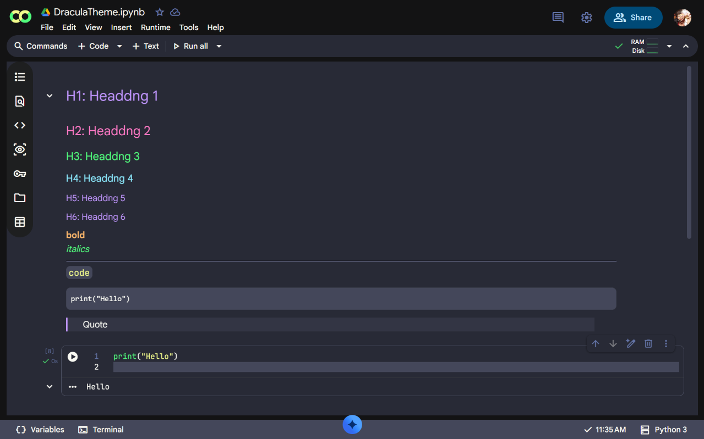

# Dracula for [Google Colab](https://colab.research.google.com)

> A dark theme for [Google Colab](https://colab.research.google.com).

## Install

All instructions can be found at [draculatheme.com/google-colab](https://draculatheme.com/google-colab).

Direct Installation link [stylus-google-colab-dracula](https://userstyles.world/api/style/29907.user.css) [Requires [Stylus Extension for Browser](https://add0n.com/stylus.html)]

## Team

This theme is maintained by the following person(s) and a bunch of [awesome contributors](https://github.com/dracula/google-colab/graphs/contributors).

|  |  |  |
| ---------------------------------------------------------------------------------------- | --------------------------------------------------------------------------------------------- | ------------------------------------------------------------------------------------------- |
| [Zeno Rocha](https://github.com/zenorocha)                                               | [Lucas de França](https://github.com/luxonauta)                                               | [Paarth Siloiya](https://github.com/paarthsiloiya)                                                 |

## Community

- [Twitter](https://twitter.com/draculatheme) - Best for getting updates about themes and new stuff.
- [GitHub](https://github.com/dracula/dracula-theme/discussions) - Best for asking questions and discussing issues.
- [Discord](https://draculatheme.com/discord-invite) - Best for hanging out with the community.

## Dracula PRO

## License

[MIT License](./LICENSE)
